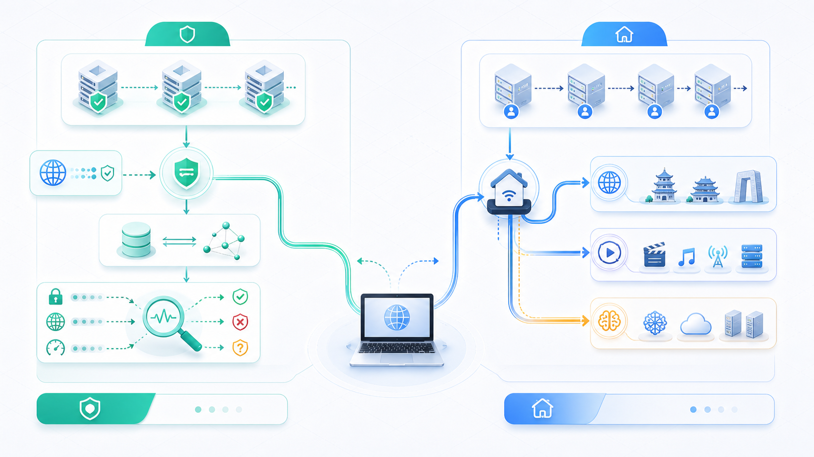
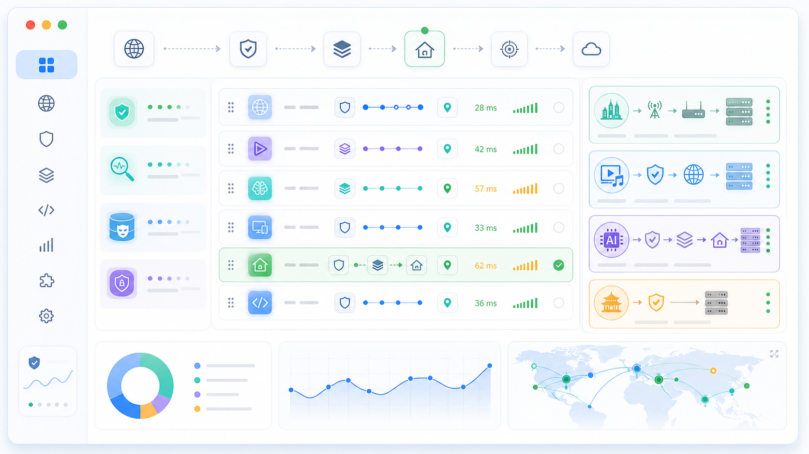
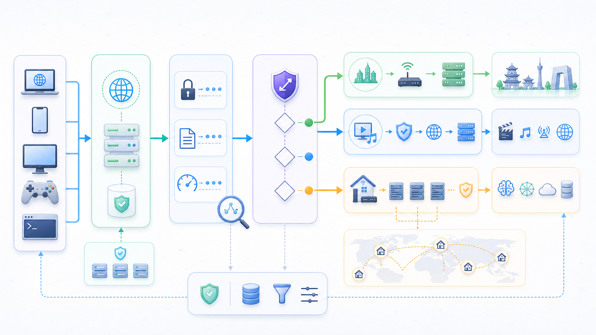

# clash-override-chain-proxy


> Clash 覆写脚本，通过链式代理将 AI 相关流量锁定到干净的家宽 IP，防止 IP 指纹不一致导致的账号封禁。

AI 平台（OpenAI、Anthropic 等）的风控系统会追踪 IP 指纹一致性。当 Stripe 支付、Arkose 验证、Statsig 遥测等关联请求的出口 IP 与主会话不一致时，账号容易被判定违规。常见原因包括：共享代理 IP 信誉差、DNS 泄漏、WebRTC 泄漏等。

本脚本的解决方案：**机场节点提供速度，家宽 IP 提供纯净出口**，通过三层防泄漏机制确保所有 AI 相关流量（含登录验证、支付、遥测）始终从同一个家宽 IP 出站。

**当前版本：** v11.4

## Features

- **IP 隔离** — AI 流量（含登录验证、支付、遥测等关联请求）+ 开发平台流量锁定到家宽出口，确保 IP 指纹一致
- **媒体分离** — 视频 / 音乐 / 社交 / IM 流量走独立选区，不占用家宽带宽，可按地区自由切换
- **直连分类** — 域内服务、Apple、私有网络等走直连，CN 站点用 `GEOSITE` / `GEOIP` 兜底
- **统一策略引擎** — 所有路由 / DNS / Sniffer 决策汇总到 POLICY 一张表，覆盖订阅自带规则

完整的流量分类和出口映射见 [路由对照表](#路由对照表)。

## Requirements

- [Clash Party](https://github.com/clash-verge-rev/clash-verge-rev) 或其他兼容 JavaScriptCore 覆写的 Clash 客户端
- 一份代理订阅，至少包含 `US / JP / HK / SG / TW` 任一个地区的节点
- `overrideMode: "merged"` 需要一份家宽 IP 服务（作链式代理的前置出口）
- Node.js（仅 `tests/validate.js` 用，不是运行时依赖）

示例资源（可选）：代理订阅 [办公娱乐好帮手](https://xn--9kq10e0y7h.site/index.html?register=twb6RIec) · 家宽 IP [MiyaIP](https://www.miyaip.com/?invitecode=7670643)

## Usage

### 1. 下载两份覆写脚本

需要按顺序导入两份文件：

- [`src/residential-chain-proxy-config.js`](src/residential-chain-proxy-config.js) — 用户配置，只保存 `MIYA_CREDENTIALS` / `USER_OPTIONS`
- [`src/residential-chain-proxy-override.js`](src/residential-chain-proxy-override.js) — 稳定实现，内置 DNS / Sniffer、链式代理和媒体分流逻辑



### 2. 选择 `overrideMode`

打开 `residential-chain-proxy-config.js`，先改顶部 `USER_OPTIONS.overrideMode`：

```javascript
var USER_OPTIONS = {
  overrideMode: "merged",      // merged 或 dns-sniffer-only
  chainRegion: "SG",           // AI 家宽出口前一跳地区
  routeBrowserToChain: true    // AI 浏览器按进程名是否也走 chainRegion
};
```

| 模式 | 适合场景 | 行为边界 |
|---|---|---|
| `dns-sniffer-only` | 只想改善域内 / 域外 DNS 解析、Fake-IP 和域名嗅探，不想改现有代理组和分流规则 | 只写 `config.dns` / `config.sniffer`；不读取 `MIYA_CREDENTIALS`，不注入代理节点，不改 `proxies` / `proxy-groups` / `rules` |
| `merged` | 需要把 AI、开发平台、支付 / 验证 / 遥测统一锁定到家宽出口，同时保留媒体分离和域内直连 | 先写 DNS / Sniffer，再写 MiyaIP 节点、代理组和分流规则 |

`dns-sniffer-only` 适合先做低风险验证：

- 域内站点绑定域内 DoH：`dns.alidns.com` / `doh.pub`
- 域外站点绑定域外 DoH：`dns.google` / `cloudflare-dns.com`
- 开启 Fake-IP、`fallback-filter`、TLS / HTTP / QUIC Sniffer
- 对 Tailscale / Plex / Apple Push / 局域网等保留 `skip-domain`

### 3. 填写家宽凭证

只有 `overrideMode: "merged"` 需要在 `residential-chain-proxy-config.js` 顶部 `MIYA_CREDENTIALS` 填入家宽 IP 服务的账号和端点信息；`dns-sniffer-only` 可以保持空值。

```javascript
var MIYA_CREDENTIALS = {
  username: "你的用户名",
  password: "你的密码",
  relay:   { server: "12.34.56.78",         port: 8022 }, // 家宽出口
  transit: { server: "transit.example.com", port: 8001 }  // 官方中转
};
```

### 4. 调整链式代理选项

| 场景 | 配置 |
|---|---|
| ChatGPT 看起来在美国 | `chainRegion: "US"` |
| ChatGPT 看起来在日本 | `chainRegion: "JP"` |
| 关闭 AI 浏览器进程绑定 | `routeBrowserToChain: false` |

**支持地区：** `US` · `JP` · `HK` · `SG` · `TW`

**Fallback：** 首选地区没节点时按内置顺序自动回退：
- 链式出口：`SG → TW → JP → US`
- 媒体/其它分组：全部 5 个地区自动生成，默认优先 US

### 5. 启用

在 Clash Party 覆写页按顺序导入并启用：

1. `residential-chain-proxy-config.js`
2. `residential-chain-proxy-override.js`

随后切到机场订阅 → 启动代理（**规则模式** + **TUN 模式**）。不要选中 Clash Party 原生的「DNS 覆写」和「嗅探覆写」选项，脚本已通过 POLICY 统一接管 DNS 和 Sniffer 配置。

`overrideMode: "merged"` 会额外注入以下代理组：

| 代理组名称 | 类型 | 说明 |
|---|---|---|
| `az.核心链路.🔗 链式代理-家宽出口` | `select` | MiyaIP 家宽出口 / 官方中转二选一，`dialer-proxy` 指向同地区的分区测速组 |
| `az.分区测速.🇺🇸 美国节点组`<br>`az.分区测速.🇯🇵 日本节点组`<br>`az.分区测速.🇭🇰 香港节点组`<br>`az.分区测速.🇸🇬 新加坡节点组`<br>`az.分区测速.🇹🇼 台湾节点组` | `url-test` | 5 个地区节点池自动生成，挂载到节点选择组。定时测速，自动选择最低延迟节点 |
| `az.严管调度.🤖 AI 高敏阵列` | `select` | AI 流量，锁定到链式代理-家宽出口 |
| `az.严管调度.🛠️ 支撑平台` | `select` | 开发平台流量，锁定到链式代理-家宽出口 |
| `az.严管调度.🛡️ 生态域集成` | `select` | 支付 / 验证 / 遥测流量，锁定到链式代理-家宽出口 |
| `az.其他调度.🎬 视频流媒体` | `select` | 视频流量，默认 US，可切换地区 |
| `az.其他调度.🎵 音乐播客` | `select` | 音频流量 |
| `az.其他调度.🌐 社交长文` | `select` | 社交平台流量 |
| `az.其他调度.💬 即时通讯` | `select` | IM 流量 |

改 `chainRegion` 后组名自动跟着变；首选地区没节点时按 fallback 顺序回退。



### FAQ

- **只想启用 DNS / Sniffer 怎么配？** 在配置文件里把 `USER_OPTIONS.overrideMode` 改成 `"dns-sniffer-only"`。此模式不会读取家宽凭证，也不会改代理组或规则。
- **完整链式代理怎么配？** 使用 `overrideMode: "merged"`，并在配置文件里填入 `MIYA_CREDENTIALS`。实现脚本会先接管 DNS / Sniffer，再注入链式代理和媒体分流规则。
- **`merged` 报错 `请先在 residential-chain-proxy-config.js 填写...`** — 凭证仍是空值，或配置文件没有排在实现文件前面。填入 MiyaIP 用户名、密码、家宽出口和官方中转端点，并确认导入顺序。
- **报错 `未找到可用的 chainRegion 节点`** — 订阅中没有可识别的目标地区节点。确认至少有一个 `US / JP / HK / SG / TW` 节点，且节点名能被 `BASE.regions[XX].regex` 匹配（默认识别国旗 emoji、中文地区名、`US-` / `JP-` 等前缀）。

### 升级 / 卸载

- **升级**：通常只重新下载 `residential-chain-proxy-override.js` 覆盖实现文件；保留本地 `residential-chain-proxy-config.js`。脚本是幂等的，重复运行不会产生重复组。
- **卸载**：关掉相关覆写，刷新订阅即可还原。

## Testing

```bash
node tests/validate.js
```

使用 `vm` 隔离加载配置脚本和实现脚本，覆盖 `dns-sniffer-only`、`merged`、凭证校验、地区 fallback、开关组合、缺失地区报错、幂等重跑、受管对象修复、拆分文件传参等 17 个用例。

## Architecture

### 数据流



三层流水线：**用户配置 → 策略 → 配置**。配置脚本先把 `USER_OPTIONS` / `MIYA_CREDENTIALS` 写入临时字段，随后实现脚本读取并删除该字段，再用 `USER_OPTIONS.overrideMode` 控制执行边界：

- `dns-sniffer-only` 只消费 `DERIVED` 写入 `config.dns` / `config.sniffer`，随后直接返回配置。
- `merged` 先写入 `config.dns` / `config.sniffer`，再读取 `MIYA_CREDENTIALS` 注入内部凭证，最后消费同一份 `DERIVED` 写入分流规则并删除临时字段。

| 模块 | 说明 |
|---|---|
| `residential-chain-proxy-config.js` | 用户配置入口，升级实现文件时通常保留 |
| `residential-chain-proxy-override.js` | 稳定实现入口，读取配置脚本传入的临时状态 |
| `DNS_SNIFFER_MODULE` | DNS / Sniffer 策略模块，两种模式共用 |
| `MIYA_CREDENTIALS` | MiyaIP 用户名、密码、家宽出口和官方中转端点 |
| `USER_OPTIONS` | 模式选择 + 地区选择 + 浏览器开关 |
| `BASE` | 运行期常量：地区表、节点名、组名、DoH 服务器 |
| `CHAIN` / `MEDIA` / `CDN` / `CN` / `OVERSEAS` / `LOCAL` / `DNS_ONLY` / `NETWORK` | `+.domain` 域名模式，按路由意图或解析意图分桶 |
| `POLICY` | 单一权威表，每条 entry 声明 `route` / `dnsZone` / `sniffer` / `fakeIpBypass` / `fallbackFilter` |
| `DERIVED` | 从 POLICY 投影的下游视图：`patterns`、`processNames`、`networkRules` |
| `EXPECTED_ROUTES` | 端到端路由样本，加载期 + 测试共用 |

### DNS 防泄漏

分流规则只决定出口。DNS 解析到错误地区、TLS 握手前域名未被嗅探到，都会导致出口跑偏。脚本让 DNS / Sniffer / 分流规则三层共用同一份 POLICY，改一处全同步：

| DNS 分区 | DoH 服务器 | 用途 |
|---|---|---|
| 域外 DoH | `dns.google` / `cloudflare-dns.com` | AI、开发平台、媒体等域外域名，走代理在境外解析 |
| 域内 DoH | `dns.alidns.com` / `doh.pub` | 办公、云、消费类等域内域名，本地直接解析 |

`nameserver-policy` 先写入大类兜底，再写入显式域名：

| 层级 | 匹配 | DNS |
|---|---|---|
| 域内大类 | `geosite:cn` | 域内 DoH |
| 域外大类 | `geosite:geolocation-!cn` | 域外 DoH |
| 显式域名 | `POLICY` 投影出的 `+.domain` | 按 `dnsZone` 覆盖大类兜底 |

OpenAI、Claude / Anthropic 等高敏服务不依赖专项 GeoSite 集合；它们由 `CHAIN.ai` 里的显式域名表维护。遇到 GeoSite 大类覆盖不准但又不想改变路由时，添加到 `DNS_ONLY.domestic` 或 `DNS_ONLY.overseas`。

| 配置项 | 来源字段 | 作用 |
|---|---|---|
| `nameserver-policy` | GeoSite 大类 + `dnsZone` | CN / 非 CN 解析兜底；显式域名按 `"overseas"` / `"domestic"` 覆盖 |
| `fake-ip-filter` | `fakeIpBypass` | Apple 推送、NTP、STUN、游戏主机等对真实 IP 敏感的域名 |
| `force-domain` | `sniffer: "force"` | chain 域名 + Cloudflare — 强制从 SNI 恢复域名，防止漏到 MATCH（详见下方 Sniffer 章节） |
| `skip-domain` | `sniffer: "skip"` | Tailscale / Plex / Apple 推送等 — 保留 IP 语义，嗅探反而破坏 P2P 打洞 |
| `fallback-filter` | `fallbackFilter` | 兜底：非 CN IP 走域外 DoH（`geoip-code: CN`） |

### Sniffer — Fake-IP 模式的安全网

Clash 在 `enhanced-mode: fake-ip` 下，客户端查 DNS 时直接返回一个假地址（`198.18.x.x`），不等真实解析完成。连接到达时，Clash 通常能从内部映射表反查出域名，用域名去匹配分流规则。

但有些场景映射会丢失或根本不存在：

- Fake-IP 缓存过期后，应用复用了旧连接里的 IP
- QUIC (HTTP/3) 跳过 DNS，直接用上次缓存的 IP 发起 UDP 连接
- 某些应用硬编码 IP，从不走 DNS

这时 Clash 只看到一个对某 IP 的连接，没有域名 → 所有 `DOMAIN-SUFFIX` 规则都匹配不了 → 流量落到 `MATCH` 兜底 → **走错出口**。对于 AI 域名，这意味着流量可能绕过链式代理，直接暴露当前 IP。

**Sniffer 的作用：** 在转发之前，偷看（sniff）握手包的头几个字节，从 TLS ClientHello 的 SNI 字段 / HTTP 的 Host 头 / QUIC 握手中提取出真实域名，让规则重新命中。

脚本通过 POLICY 的 `sniffer` 字段自动生成两个列表：

| 列表 | POLICY 字段 | 包含谁 | 为什么 |
|---|---|---|---|
| `force-domain` | `sniffer: "force"` | 所有 chain 路由域名 + Cloudflare | 确保即使映射丢失，AI 流量也能从 SNI 恢复域名 → 命中链式代理规则，不漏到 MATCH |
| `skip-domain` | `sniffer: "skip"` | Tailscale / ZeroTier / Plex / Synology / Apple 推送 / 局域网 | 这些服务**故意**用 IP 语义工作（P2P 打洞、推送通道）；嗅探会把 IP 替换成域名，反而破坏连接 |

### `respect-rules: true` — DNS 查询也走代理

脚本启用了 `respect-rules: true`，让 DNS 查询本身也遵循分流规则，而不是全部从本地网络直连发出。

**为什么需要：** `respect-rules: false`（Clash 默认值）时，所有 DoH 查询都从你本地网络直连发到 `dns.google`。出差到 CN 时意味着：
- `dns.google` / `cloudflare-dns.com` 被墙 → 查询超时，浪费数秒
- 如果部分可达，Google DNS 日志里会留下"CN IP 查了 claude.ai"这样的痕迹

启用后，chain 域名的 DoH 查询经链式代理从 SG 家宽出去；direct 域名走 `direct-nameserver`（域内 DoH）本地解析。无论你人在新加坡还是北京酒店，`dns.google` 看到的来源永远是你的 SG 家宽 IP。

**三阶防泄漏时序：**

```
1. 本地寻址    proxy-server-nameserver（域内 DoH）解析代理节点 IP → 建立代理隧道（不触发分流）
               ↓
2. 隧道内 DNS  DoH 查询（dns.google 等）经代理隧道到 SG 家宽 → 在境外完成加密解析
               ↓
3. 远端连接    AI 请求 Fake-IP 本地握手 → 实际域名在 SG 家宽节点解析 → AI 服务端只看到家宽 IP
```

> [!CAUTION]
> 必须关闭浏览器的"安全 DNS / Secure DNS"功能。该功能绕过系统网络栈（跳过 Clash 的 Fake-IP），会导致真实 IP 泄漏。

### 路由对照表

| 出口 | SOURCE | DNS | 内容 |
|---|---|---|---|
| `az.严管调度.🤖 AI 高敏阵列` | `CHAIN.ai` | 域外 DoH | Anthropic / OpenAI / Google AI / Perplexity / Cursor / xAI / Meta AI<br>OpenRouter / Antigravity / Mistral / Hugging Face / Replicate / Groq<br>Together / ElevenLabs / Midjourney / Runway / Stability / Ideogram<br>Civitai / Character.ai / Pi / You / Phind / Kagi |
| `az.严管调度.🛠️ 支撑平台` | `CHAIN.support` | 域外 DoH | Google / Microsoft / GitHub / GitLab / Atlassian<br>npm / PyPI / crates.io / Docker Hub / RubyGems<br>Vercel / Netlify / Supabase / Fly.io / Render / Railway<br>JetBrains / Stack Overflow / MDN / Read the Docs / GitBook |
| `az.严管调度.🛡️ 生态域集成` | `CHAIN.integrations` | 域外 DoH | 反机器人：Arkose / FunCaptcha / reCAPTCHA / hCaptcha<br>鉴权：Auth0 / Clerk / Okta<br>支付：Stripe / PayPal / Paddle / Lemon Squeezy<br>遥测：Statsig / Sentry / PostHog / Segment / Mixpanel / Amplitude / Datadog<br>基础设施：Cloudflare（含 Turnstile） |
| `az.严管调度.🤖 AI 高敏阵列`（按进程名兜底） | `CHAIN.apps` | — | 位于显式域名和 CN 兜底之后。桌面 App：Claude / ChatGPT / Perplexity / Cursor / Quotio<br>AI 浏览器：Dia / Atlas / SunBrowser<br>CLI：`claude` / `gemini` / `codex` |
| `az.其他调度.🎬 视频流媒体` | `MEDIA.video` | 域外 DoH | YouTube / Netflix / Disney+ / HBO Max / Hulu / Prime Video / Twitch<br>Peacock / Paramount+ / Crunchyroll / Vimeo / Dailymotion |
| `az.其他调度.🎵 音乐播客` | `MEDIA.music` | 域外 DoH | Spotify / SoundCloud / Bandcamp |
| `az.其他调度.🌐 社交长文` | `MEDIA.social` | 域外 DoH | X / Meta (Facebook / Instagram / Threads) / Reddit / TikTok<br>Snapchat / Pinterest / Bluesky / Tumblr<br>Medium / Substack / Patreon / Goodreads / Letterboxd |
| `az.其他调度.💬 即时通讯` | `MEDIA.im` | 域外 DoH | Telegram / Discord / LINE / WhatsApp / Signal |
| 默认代理 | `CDN` | 域外 DoH | DoH：dns.google / cloudflare-dns.com / quad9.net<br>CDN：Cloudflare / AWS / CloudFront / Fastly / Akamai<br>Azure CDN / jsDelivr / Bunny / Cloudinary |
| `DIRECT` | `CN` | 域内 DoH | 显式 CN 域名 + `GEOSITE,cn` / `GEOIP,CN` 兜底。AI：DeepSeek / Doubao / MiniMax / Baichuan / Stepfun / 通义 / Moonshot / 智谱 / SiliconFlow<br>办公：腾讯 / 钉钉 / 飞书 / WPS<br>云：阿里云 / 腾讯云 / 火山引擎 / 华为云 / 百度云 / 京东云 / 七牛 / 又拍 / 网宿 / 天翼 / 金山<br>消费：百度 / Bilibili / 微博 / 知乎 / 小红书 / 抖音 / 快手<br>网易 / 爱奇艺 / 优酷 / 芒果TV / 搜狐<br>淘宝 / 天猫 / 京东 / 拼多多 / 美团 / 大众点评 / 米哈游 |
| `DIRECT` | `OVERSEAS.apple` | 域内 + 域外并行（fallback-filter 按 geoip 仲裁） | Apple / iCloud（不绑定单侧 DoH，确保 SG 与 CN 都能正常登录 Apple Store） |
| `DIRECT` | `OVERSEAS.other` | 域外 DoH | 出口验证（ip.sb / ifconfig.me / ipinfo.io / ping0.cc）<br>沉浸式翻译 / MinerU（域内应用，因域内 DNS 解析异常而使用域外 DoH）<br>Tailscale / ZeroTier / Plex / Synology / Typeless |
| `DIRECT` | `LOCAL` | 域内 DoH | Apple 推送 / `.lan` / `.local` / `.localhost` / `.home.arpa` |
| — | `DNS_ONLY` | 按桶选择域内 / 域外 DoH | 只修正解析，不生成分流规则；用于 GeoSite 大类覆盖不准的个别站点 |
| `DIRECT` | `NETWORK` | — | RFC 1918（10/8, 172.16/12, 192.168/16）<br>链路本地（169.254/16, fe80::/10）<br>CGNAT（100.64/10）/ Tailscale magic IP<br>IPv6 ULA（fc00::/7） |

修改路由归类只需改 `POLICY` 对应源桶，`nameserver-policy` / 分流规则 / Sniffer / `fallback-filter` 自动同步。只修正解析、不改变出口时，改 `DNS_ONLY`。

规则顺序固定为：高敏域名 → 媒体域名 → DoH 端点 → 显式 DIRECT → CN 兜底 → AI 进程兜底 → 订阅非 `MATCH` → `MATCH`。域外普通网站不做统一美国化，继续交给显式规则或订阅兜底。

### 校验

| 函数 | 时机 | 说明 |
|---|---|---|
| `assertExpectedRoutesCoverage` | 加载期 | 样本域名必须在域名模式中有覆盖 |
| `validateManagedRouting` | 运行期 | 规则、组、`dialer-proxy` 正确 |
| `tests/validate.js` | 测试 | `vm` 隔离运行 17 个用例 |

### 函数命名约定

| 前缀 | 含义 |
|---|---|
| `build*` | 纯函数，只返回值 |
| `resolve*` | 读 + 幂等写 |
| `write*` | 改 config |
| `assert*` | 断言，失败抛错 |

## Compatibility

- **运行环境：** Clash Party 的 JavaScriptCore
- **语法：** ES5（无箭头函数、解构、模板字符串、展开语法）
- **进程分流：** 当前只维护 macOS 进程名，其他平台需自行扩展

## License

MIT — 见 [LICENSE](LICENSE)。   
