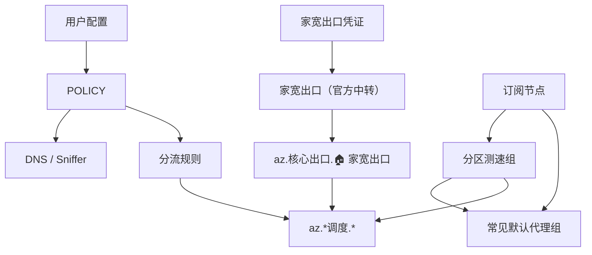

# clash-override-residential-exit

Clash 覆写脚本。通过 `家宽出口（官方中转）` 提供固定家宽出口，并把 AI、开发平台、支付验证、遥测等高敏流量集中到可手动切换的调度面板里，降低出口 IP 不一致带来的风控风险。

**当前版本：** v12.0

## Features

- **固定家宽出口**：`az.核心出口.🏠 家宽出口` 只包含 `家宽出口（官方中转）`。
- **手动调度面板**：所有 `az.*调度.*` 组默认候选为家宽出口 + 已生成的分区测速组，不包含订阅原始总选择组。
- **默认代理自动识别**：按常见组名查找订阅默认代理组，例如 `PROXY`、`Proxy`、`节点选择`、`代理`、`GLOBAL`。
- **分区测速备选**：自动生成 `US / JP / HK / SG / TW` 中订阅实际存在的地区测速组。
- **DNS / Sniffer 防漏**：DNS、Fake-IP、Sniffer 和规则都由同一份 `POLICY` 派生。
- **媒体分离**：视频、音乐、社交、IM 可在独立调度面板中手动选择出口。

## Quick Start

1. 下载 [`src/residential-exit-override.js`](src/residential-exit-override.js)。
2. 打开文件，填写 `RESIDENTIAL_CREDENTIALS`。
3. 按需调整 `USER_OPTIONS.overrideMode`。
4. 在 Clash 覆写页导入并启用这个文件。
5. 使用规则模式和 TUN 模式启动。

## Requirements

- Clash Verge 或其他兼容 JavaScriptCore 覆写的 Clash 客户端。
- 一份代理订阅，最好包含 `US / JP / HK / SG / TW` 中至少一个地区节点，用作手动备选。
- `merged` 模式需要家宽出口官方中转端点。
- Node.js 仅用于运行测试。

## Configuration

### USER_OPTIONS

```javascript
var USER_OPTIONS = {
  // dns-sniffer-only = 只写 DNS/Sniffer
  overrideMode: "merged"
};
```

| 选项 | 说明 |
|---|---|
| `overrideMode: "merged"` | 写入 DNS / Sniffer、家宽出口节点、代理组和规则 |
| `overrideMode: "dns-sniffer-only"` | 只写入 DNS / Sniffer，不读取家宽出口凭证 |

### RESIDENTIAL_CREDENTIALS

```javascript
var RESIDENTIAL_CREDENTIALS = {
  username: "你的用户名",
  password: "你的密码",
  transit: {
    server: "transit.example.com",
    port: 8001
  }
};
```

## Proxy Groups

`merged` 模式会注入或修正以下代理组：

| 代理组 | 类型 | 说明 |
|---|---|---|
| `az.核心出口.🏠 家宽出口` | `select` | 只包含 `家宽出口（官方中转）` |
| `az.分区测速.🇺🇸 美国节点组` | `url-test` | 订阅存在美国节点时生成 |
| `az.分区测速.🇯🇵 日本节点组` | `url-test` | 订阅存在日本节点时生成 |
| `az.分区测速.🇭🇰 香港节点组` | `url-test` | 订阅存在香港节点时生成 |
| `az.分区测速.🇸🇬 新加坡节点组` | `url-test` | 订阅存在新加坡节点时生成 |
| `az.分区测速.🇹🇼 台湾节点组` | `url-test` | 订阅存在台湾节点时生成 |
| `az.严管调度.🤖 AI 高敏阵列` | `select` | AI 域名、AI App、AI CLI、AI 浏览器进程 |
| `az.严管调度.🛠️ 支撑平台` | `select` | Google / Microsoft / GitHub / 开发平台 / CDN 基础设施 |
| `az.严管调度.🛡️ 生态域集成` | `select` | 反机器人、鉴权、支付、遥测 |
| `az.其他调度.🎬 视频流媒体` | `select` | 视频流媒体 |
| `az.其他调度.🎵 音乐播客` | `select` | 音乐与播客 |
| `az.其他调度.🌐 社交长文` | `select` | 社交与长文平台 |
| `az.其他调度.💬 即时通讯` | `select` | IM 服务 |

所有调度组的候选顺序为：

```text
az.核心出口.🏠 家宽出口
az.分区测速.🇺🇸 美国节点组
az.分区测速.🇭🇰 香港节点组
az.分区测速.🇯🇵 日本节点组
az.分区测速.🇹🇼 台湾节点组
az.分区测速.🇸🇬 新加坡节点组
```

不存在节点的地区不会出现在候选项里。

脚本会把生成的分区测速组追加到订阅中实际存在的常见默认代理组；没有匹配到常见默认组时，DoH 端点规则会回落到 `az.核心出口.🏠 家宽出口`，避免写入不存在的目标。

## Data Flow



## DNS And Sniffer

脚本启用 `enhanced-mode: fake-ip`、`respect-rules: true` 和 TLS / HTTP / QUIC Sniffer。

| 配置 | 来源 | 作用 |
|---|---|---|
| `nameserver-policy` | `POLICY.dnsZone` | 域内、域外解析分区 |
| `fake-ip-filter` | `POLICY.fakeIpBypass` | Apple 推送、NTP、STUN、局域网等返回真实 IP |
| `force-domain` | `POLICY.sniffer === "force"` | 高敏域名从 SNI / Host 恢复域名，避免落到兜底 |
| `skip-domain` | `POLICY.sniffer === "skip"` | P2P、局域网、推送等保留 IP 语义 |
| `fallback-filter` | `POLICY.fallbackFilter` | 非 CN 结果优先走域外 DoH |

## Route Sources

| 源桶 | 出口面板 |
|---|---|
| `RESIDENTIAL_EXIT.ai` | `az.严管调度.🤖 AI 高敏阵列` |
| `RESIDENTIAL_EXIT.support` + `CDN.cloud` | `az.严管调度.🛠️ 支撑平台` |
| `RESIDENTIAL_EXIT.integrations` + Cloudflare | `az.严管调度.🛡️ 生态域集成` |
| `MEDIA.video` | `az.其他调度.🎬 视频流媒体` |
| `MEDIA.music` | `az.其他调度.🎵 音乐播客` |
| `MEDIA.social` | `az.其他调度.🌐 社交长文` |
| `MEDIA.im` | `az.其他调度.💬 即时通讯` |
| `CN` / `LOCAL` / `NETWORK` | `DIRECT` |

规则顺序固定为：高敏域名、媒体域名、DoH 端点、显式直连、CN 兜底、AI 进程兜底、订阅非 `MATCH` 规则、`MATCH`。

## Testing

```bash
node tests/test.js
```

测试通过 `vm` 加载单文件覆写脚本，覆盖 12 个纯函数单元测试和 19 个端到端集成测试。

## Compatibility

- 运行环境：Clash Verge 的 JavaScriptCore。
- 语法：ES5。
- 进程分流：当前维护 macOS 进程名，其他平台可自行扩展。

## License

MIT — 见 [LICENSE](LICENSE)。
