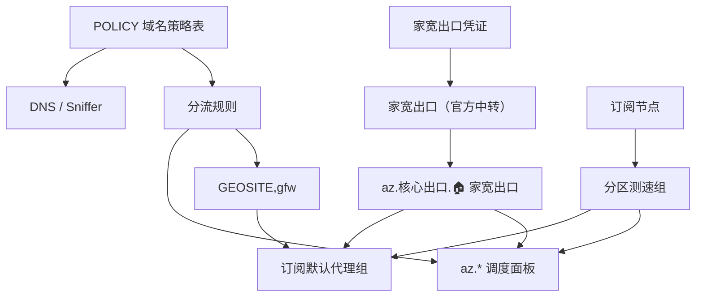

# clash-override-residential-exit

Clash 覆写脚本。通过 `家宽出口（官方中转）` 提供固定家宽出口，把 AI、开发平台、支付验证、遥测等高敏流量集中到可手动切换的调度面板里，降低出口 IP 不一致带来的风控风险。

**当前版本：** v14.7

## 快速开始

1. 下载 [`src/residential-exit-override.js`](src/residential-exit-override.js)
2. 填写 `RESIDENTIAL_CREDENTIALS` 和 `USER_OPTIONS`
3. 在 Clash 覆写页导入启用，规则模式 + TUN 启动

```javascript
var USER_OPTIONS = {
  enabled: true,                              // false = 完全旁路
  overrideMode: "merged"                      // "merged" | "dns-sniffer-only"
};

var RESIDENTIAL_CREDENTIALS = {
  username: "你的用户名",
  password: "你的密码",
  transit: { server: "transit.example.com", port: 8001 }
};
```

| 选项 | 说明 |
|---|---|
| `enabled: false` | 旁路覆写，config 原样透传 |
| `overrideMode: "merged"` | DNS / Sniffer + 家宽出口 + 代理组 + 规则 |
| `overrideMode: "dns-sniffer-only"` | 只写 DNS / Sniffer，不读凭证 |

## 工作原理

脚本接收订阅 config，全部接管：

- **代理组** — 清除订阅附带的分组，只保留 `az.*` 管理组和默认代理组。家宽出口和分区测速组注入默认组候选列表。
- **规则** — 丢弃订阅全部规则，由 POLICY 投影生成。顺序：QUIC 拦截（UDP:443 全局 REJECT）→ AI/支撑/集成域名（suffix + keyword 双轨）→ 媒体域名 → DoH → 直连 → CN → GFW → 进程 → MATCH。
- **DNS** — Fake-IP 模式、`respect-rules: true`。高敏域名通过 `nameserver-policy` 显式绑定域外 DoH，`sniffer.force-domain` 兜底恢复域名。
- **节点** — 全部保留不动。
- **默认代理组** — 按关键词（`PROXY`、`节点选择`、`手动选择`、`GLOBAL`）识别，失败时从 MATCH 规则提取。MATCH / DoH / GFW 统一指向它。

## 代理组

| 代理组 | 类型 | 流量 |
|---|---|---|
| `az.分区测速.🇺🇸 美国节点组` | url-test | 订阅中的美国节点 |
| `az.分区测速.🇯🇵 日本节点组` | url-test | 订阅中的日本节点 |
| `az.分区测速.🇸🇬 新加坡节点组` | url-test | 订阅中的新加坡节点 |
| `az.分区测速.🇭🇰 香港节点组` | url-test | 订阅中的香港节点 |
| `az.核心出口.🏠 家宽出口` | select | 只含官方中转节点 |
| `az.严管调度.🤖 AI 高敏阵列` | select | AI 域名 / App / CLI / 浏览器 |
| `az.严管调度.🛠️ 支撑平台` | select | Google / Microsoft / GitHub / 开发平台 / CDN |
| `az.严管调度.🛡️ 生态域集成` | select | 反机器人 / 鉴权 / 支付 / 遥测 |
| `az.其他调度.🎬 视频流媒体` | select | YouTube / Netflix / Disney+ / Hulu / Twitch 等 |
| `az.其他调度.🎵 音乐播客` | select | Spotify / SoundCloud / Bandcamp |
| `az.其他调度.🌐 社交长文` | select | X / Facebook / Instagram / Reddit / LinkedIn 等 |
| `az.其他调度.💬 即时通讯` | select | Telegram / Discord / LINE / WhatsApp / Slack / Zoom 等 |

所有调度组候选顺序统一：

```
🇺🇸 美国 → 🇯🇵 日本 → 🇸🇬 新加坡 → 🇭🇰 香港 → 🏠 家宽出口
```

不存在的地区不会出现。

## 路由映射

| 源桶 | 出口面板 |
|---|---|
| `RESIDENTIAL_EXIT.ai` | `az.严管调度.🤖 AI 高敏阵列` |
| `RESIDENTIAL_EXIT.support` + `CDN.cloud` | `az.严管调度.🛠️ 支撑平台` |
| `RESIDENTIAL_EXIT.integrations` + Cloudflare | `az.严管调度.🛡️ 生态域集成` |
| `MEDIA.video` | `az.其他调度.🎬 视频流媒体` |
| `MEDIA.music` | `az.其他调度.🎵 音乐播客` |
| `MEDIA.social` | `az.其他调度.🌐 社交长文` |
| `MEDIA.im` | `az.其他调度.💬 即时通讯` |
| `GFWLIST`（`GEOSITE,gfw`） | 订阅默认代理组 |
| `CN` / `LOCAL` / `NETWORK` / `OVERSEAS` | `DIRECT` |

## 行为边界

以下是有意的设计取舍，了解可避免意外：

- **进程规则在 CN / GFW 之后**：AI / 浏览器进程规则只作兜底，仅当流量未被任何域名规则、`GEOSITE,cn`、`GEOSITE,gfw` 命中时才生效。AI 核心域名由前置 `DOMAIN-SUFFIX` 规则锁定到家宽出口面板，不受影响；但 AI 进程访问的、被 `gfw` 收录且未显式维护的域名会先走默认代理组。
- **默认代理组按关键词识别**：按 `PROXY` / `节点选择` / `手动选择` / `GLOBAL` 顺序，大小写不敏感地子串匹配第一个命中的组；全部未命中时回退到 `MATCH` 规则提取。若订阅先出现一个名字含这些关键词的非默认组，可能被误选。

## DNS 与 Sniffer

| 配置 | 来源 | 作用 |
|---|---|---|
| `nameserver-policy` | POLICY dnsZone | 逐条绑定域外/域内 DoH |
| `fake-ip-filter` | POLICY + 系统常量 | NTP、STUN、推送、局域网返回真实 IP |
| `force-domain` | 家宽出口全量域名 | SNI/Host 恢复域名，防漏到 MATCH |
| `skip-domain` | P2P/推送/局域网 | 保留 IP 语义，不嗅探 |
| `fallback-filter` | geoip + geosite:gfw | 非 CN 结果自动走域外 DoH |

## 数据流



## 要求

- Clash Verge 或兼容 JavaScriptCore 覆写的客户端
- 代理订阅（`US / JP / HK / SG` 中至少一个地区节点）
- `merged` 模式需家宽出口中转端点
- Node.js 仅用于运行测试：`node tests/test.js`（16 单元 + 25 集成）

## License

MIT — 见 [LICENSE](LICENSE)。
