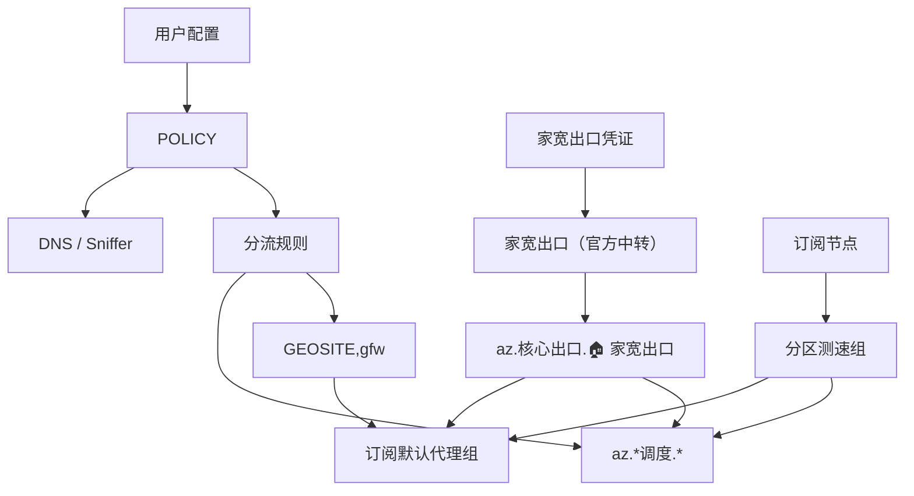

# clash-override-residential-exit

Clash 覆写脚本。通过 `家宽出口（官方中转）` 提供固定家宽出口，并把 AI、开发平台、支付验证、遥测等高敏流量集中到可手动切换的调度面板里，降低出口 IP 不一致带来的风控风险。

**当前版本：** v13.0

## Features

- **总开关**：`enabled: false` 即可完全旁路覆写，无需导入/删除文件。
- **订阅全接管**：丢弃订阅所有规则和附加代理组，只保留节点和默认代理组，由脚本统一接管分流。
- **GFWList 代理**：使用 `GEOSITE,gfw` 将 GFW 域名路由到默认代理组。
- **规则兜底**：`DOMAIN-KEYWORD` 规则接住 `DOMAIN-SUFFIX` 实现差异遗漏的子域。
- **固定家宽出口**：`az.核心出口.🏠 家宽出口` 只包含 `家宽出口（官方中转）`。
- **手动调度面板**：所有调度组默认优选 🇺🇸 美国节点组，`az.核心出口.🏠 家宽出口` 作为备选。
- **默认代理自动识别**：按关键词匹配，失败时从 MATCH 规则提取组名。
- **分区测速备选**：自动生成 `US / JP / HK / SG` 中订阅实际存在的地区测速组，注入默认代理组候选列表。
- **DNS / Sniffer 防漏**：DNS、Fake-IP、Sniffer 和规则都由同一份 `POLICY` 派生。
- **媒体分离**：视频、音乐、社交、IM 可在独立调度面板中手动选择出口。
- **多订阅兼容**：自动清除 `rule-providers`，防止 RULE-SET 规则逃逸。

## Quick Start

1. 下载 [`src/residential-exit-override.js`](src/residential-exit-override.js)。
2. 打开文件，填写 `RESIDENTIAL_CREDENTIALS`。
3. 按需调整 `USER_OPTIONS.enabled` 和 `overrideMode`。
4. 在 Clash 覆写页导入并启用这个文件。
5. 使用规则模式和 TUN 模式启动。

## Requirements

- Clash Verge 或其他兼容 JavaScriptCore 覆写的 Clash 客户端。
- 一份代理订阅，最好包含 `US / JP / HK / SG` 中至少一个地区节点，用作手动备选。
- `merged` 模式需要家宽出口官方中转端点。
- Node.js 仅用于运行测试。

## Configuration

### USER_OPTIONS

```javascript
var USER_OPTIONS = {
  enabled: true, // false = 关闭覆写，config 原样透传
  // dns-sniffer-only = 只写 DNS/Sniffer
  overrideMode: "merged"
};
```

| 选项 | 说明 |
|---|---|
| `enabled: true` | 开启覆写（默认）；设为 `false` 则完全旁路 |
| `overrideMode: "merged"` | 写入 DNS / Sniffer、家宽出口节点、代理组和规则 |
| `overrideMode: "dns-sniffer-only"` | 只写入 DNS / Sniffer，不读取家宽出口凭证 |

### RESIDENTIAL_CREDENTIALS

```javascript
var RESIDENTIAL_CREDENTIALS = {
  username: "你的用户名",
  password: "你的密码",
  transit: {
    server: "transit.example.com",
    port: 8001
  }
};
```

## Proxy Groups

`merged` 模式会注入或修正以下代理组：

| 代理组 | 类型 | 说明 |
|---|---|---|
| `az.核心出口.🏠 家宽出口` | `select` | 只包含 `家宽出口（官方中转）` |
| `az.分区测速.🇺🇸 美国节点组` | `url-test` | 订阅存在美国节点时生成 |
| `az.分区测速.🇯🇵 日本节点组` | `url-test` | 订阅存在日本节点时生成 |
| `az.分区测速.🇭🇰 香港节点组` | `url-test` | 订阅存在香港节点时生成 |
| `az.分区测速.🇸🇬 新加坡节点组` | `url-test` | 订阅存在新加坡节点时生成 |
| `az.严管调度.🤖 AI 高敏阵列` | `select` | AI 域名、AI App、AI CLI、AI 浏览器进程 |
| `az.严管调度.🛠️ 支撑平台` | `select` | Google / Microsoft / GitHub / 开发平台 / CDN 基础设施 |
| `az.严管调度.🛡️ 生态域集成` | `select` | 反机器人、鉴权、支付、遥测 |
| `az.其他调度.🎬 视频流媒体` | `select` | 视频流媒体 |
| `az.其他调度.🎵 音乐播客` | `select` | 音乐与播客 |
| `az.其他调度.🌐 社交长文` | `select` | 社交与长文平台 |
| `az.其他调度.💬 即时通讯` | `select` | IM 服务 |

`az.严管调度.*` 和 `az.其他调度.*` 的候选顺序统一为：

```text
az.分区测速.🇺🇸 美国节点组
az.核心出口.🏠 家宽出口
az.分区测速.🇭🇰 香港节点组
az.分区测速.🇯🇵 日本节点组
az.分区测速.🇸🇬 新加坡节点组
```

不存在节点的地区不会出现在候选项里。

脚本清除订阅除默认代理组外的全部代理组，并将家宽出口和分区测速组注入默认代理组候选列表。默认组通过关键词（`PROXY`、`节点选择`、`手动选择`、`GLOBAL`）识别，失败时从 MATCH 规则提取组名作为兜底。MATCH / DoH / GFW 全部指向默认代理组。

## Data Flow



## DNS And Sniffer

脚本启用 `enhanced-mode: fake-ip`、`respect-rules: true` 和 TLS / HTTP / QUIC Sniffer。

| 配置 | 来源 | 作用 |
|---|---|---|
| `nameserver-policy` | `POLICY.dnsZone` | 域内、域外解析分区 |
| `fake-ip-filter` | `POLICY.fakeIpBypass` | Apple 推送、NTP、STUN、局域网等返回真实 IP |
| `force-domain` | `POLICY.sniffer === "force"` | 高敏域名从 SNI / Host 恢复域名，避免落到兜底 |
| `skip-domain` | `POLICY.sniffer === "skip"` | P2P、局域网、推送等保留 IP 语义 |
| `fallback-filter` | `POLICY.fallbackFilter` | 非 CN 结果优先走域外 DoH |

## Route Sources

| 源桶 | 出口面板 |
|---|---|
| `RESIDENTIAL_EXIT.ai` | `az.严管调度.🤖 AI 高敏阵列` |
| `RESIDENTIAL_EXIT.support` + `CDN.cloud` | `az.严管调度.🛠️ 支撑平台` |
| `RESIDENTIAL_EXIT.integrations` + Cloudflare | `az.严管调度.🛡️ 生态域集成` |
| `MEDIA.video` | `az.其他调度.🎬 视频流媒体` |
| `MEDIA.music` | `az.其他调度.🎵 音乐播客` |
| `MEDIA.social` | `az.其他调度.🌐 社交长文` |
| `MEDIA.im` | `az.其他调度.💬 即时通讯` |
| `GFWLIST` | 订阅默认代理组 |
| `CN` / `LOCAL` / `NETWORK` | `DIRECT` |

规则顺序固定为：高敏域名（suffix + keyword 双轨）→ 媒体域名 → DoH → 显式直连 → CN 兜底 → GFWList → 进程兜底 → `MATCH`。DoH / GFW / MATCH 统一指向订阅默认代理组。

### Rule Abbreviations

| 缩写 / 桶名 | 含义 | 典型网站 / 服务 | 出口 |
|---|---|---|---|
| `AI` / `RESIDENTIAL_EXIT.ai` | AI 产品与模型平台 | ChatGPT / OpenAI、Claude / Anthropic、Gemini、Perplexity、Cursor、Hugging Face、Midjourney | `az.严管调度.🤖 AI 高敏阵列` |
| `AI App / CLI` | AI 桌面应用和命令行进程 | Claude、ChatGPT、Perplexity、Cursor、`claude`、`gemini`、`codex` | `az.严管调度.🤖 AI 高敏阵列` |
| `support` / `RESIDENTIAL_EXIT.support` | AI 与开发常用支撑平台 | Google、Microsoft、GitHub、GitLab、npm、PyPI、Docker、Vercel、Netlify、Stack Overflow、MDN | `az.严管调度.🛠️ 支撑平台` |
| `integrations` / `RESIDENTIAL_EXIT.integrations` | 登录、反机器人、支付、遥测 | Arkose、reCAPTCHA、hCaptcha、Auth0、Clerk、Okta、Stripe、PayPal、Sentry、PostHog、Segment | `az.严管调度.🛡️ 生态域集成` |
| `CDN.cloud` | 云厂商与内容分发网络 | Cloudflare、AWS CloudFront、Fastly、Akamai、Azure CDN、jsDelivr、BunnyCDN、Cloudinary | `az.严管调度.🛠️ 支撑平台` |
| `DoH` / `CDN.doh` | DNS over HTTPS 解析端点 | Google DNS、Cloudflare DNS、Quad9 | 识别出的默认代理组；无默认组时回落到家宽出口 |
| `MEDIA.video` | 视频流媒体 | YouTube、Netflix、Disney+、Max、Hulu、Prime Video、Twitch | `az.其他调度.🎬 视频流媒体` |
| `MEDIA.music` | 音乐与音频平台 | Spotify、SoundCloud、Bandcamp | `az.其他调度.🎵 音乐播客` |
| `MEDIA.social` | 社交与长文平台 | X / Twitter、Facebook、Instagram、Threads、Reddit、TikTok、Snapchat、Pinterest、Bluesky、Medium、Substack | `az.其他调度.🌐 社交长文` |
| `IM` / `MEDIA.im` | Instant Messaging，即时通讯 | Telegram、Discord、LINE、WhatsApp、Signal | `az.其他调度.💬 即时通讯` |
| `CN` | 中国大陆站点直连 | 通义千问、DeepSeek、腾讯、钉钉、飞书、WPS、阿里云、腾讯云、百度、Bilibili、微博、淘宝、京东、美团 | `DIRECT` |
| `GFWList` / `GFWLIST` | GFW 封锁域，经默认代理组出口 | 由 `GEOSITE,gfw` 匹配，覆盖 GFWList 全量域 | 订阅默认代理组 |
| `LOCAL` | 本地域名与系统推送 | Apple Push、`.lan`、`.local`、`.localhost`、`.home.arpa` | `DIRECT` |
| `OVERSEAS` | 域外解析但直连的特殊服务 | Apple / iCloud、出口 IP 检测、Tailscale、ZeroTier、Plex、Synology QuickConnect | `DIRECT` |
| `DNS_ONLY` | 只影响 DNS，不生成分流规则 | CNNIC、12306、IANA、IETF | 不生成 `rules` |
| `NETWORK` | 私有网段、链路本地、CGNAT、Tailscale 地址 | `10.0.0.0/8`、`192.168.0.0/16`、`100.64.0.0/10`、`fd7a:115c:a1e0::/48` | `DIRECT` |

## Testing

```bash
node tests/test.js
```

测试通过 `vm` 加载单文件覆写脚本，覆盖 16 个纯函数单元测试和 26 个端到端集成测试。

## Compatibility

- 运行环境：Clash Verge 的 JavaScriptCore。
- 语法：ES5。
- 进程分流：当前维护 macOS 进程名，其他平台可自行扩展。

## License

MIT — 见 [LICENSE](LICENSE)。
